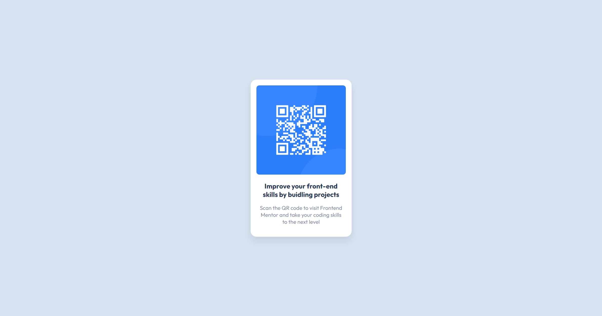

# Frontend Mentor - QR Code Component

This is a solution to the [QR Code Component challenge on Frontend Mentor](https://www.frontendmentor.io/challenges/qr-code-component-iux_sIO_H). This will also be my first challenge that I am attempting on the platform!

## Table of contents

- [Overview](#overview)
  - [Screenshot](#screenshot)
  - [Links](#links)
- [My process](#my-process)
  - [Built with](#built-with)
  - [What I learned](#what-i-learned)
  - [Continued development](#continued-development)

## Overview

### Screenshot

### Links

- Challenge URL: [https://www.frontendmentor.io/challenges/qr-code-component-iux_sIO_H](https://www.frontendmentor.io/challenges/qr-code-component-iux_sIO_H)
- Solution URL: [https://github.com/ning-sy210/QR-Code-Component](https://github.com/ning-sy210/QR-Code-Component)
- Live Site URL: [https://ning-sy210.github.io/QR-Code-Component/](https://ning-sy210.github.io/QR-Code-Component/)

## My process

### Built with

- [React](https://react.dev/) (TypeScript)
- [SASS](https://sass-lang.com/documentation/)

### What I learned

Since this is the recommended challenge for beginners new to Frontend Mentor, I don't think there's particularly lots to learn. I did get my hands dirty with SASS which is a CSS preprocessor that I found out about and got interested in during my first job.

### Continued development

I would love to learn more about SASS and the features it provides, and I will be using it more often in the future Frontend Mentor challenges.

I look forward to using some of the more advanced hooks that React has to offer, such as `useContext` and `useDispatch`.

## Author

- Frontend Mentor - [@ning-sy210](https://www.frontendmentor.io/profile/ning-sy210)
